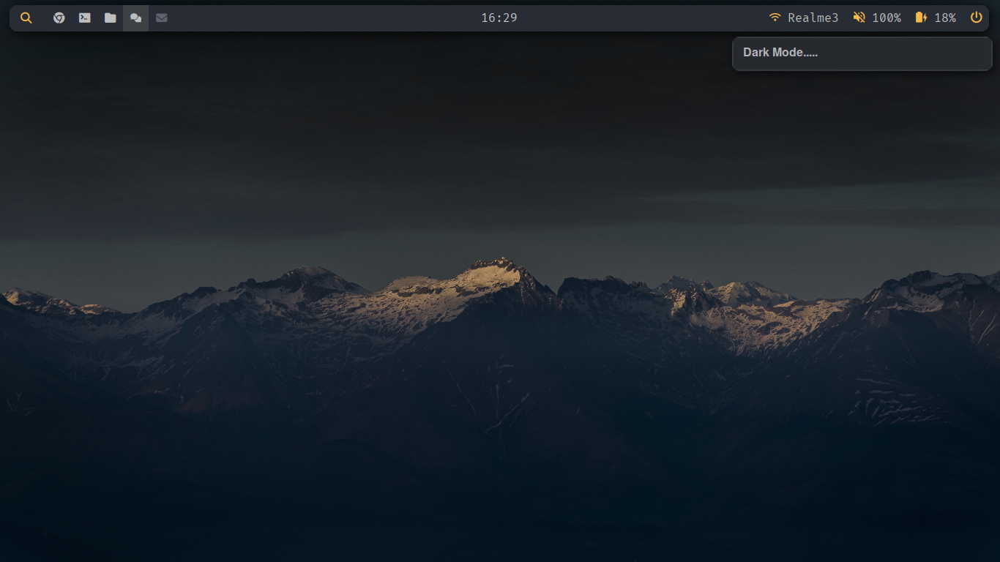
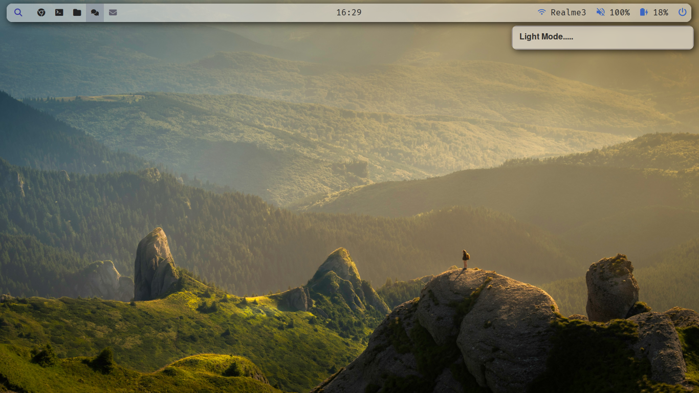

<h1 align="center">akritbehera27/dotfiles</h1>

<h4 align="center">Dark Mode</h4>

<h4 align="center">Light Mode</h4>

This is what I have and these are all of my dotfiles.

Feel free to copy any of the dotfiles or scripts you find here, as much of it is just copied from others' dotfiles. I wouldn't recommend cloning my entire setup, but instead to try copying bits and pieces as you put together your own dotfiles unique to you.

In the future I'm planning on adding an install script to make it easier for others to use my configs. For now, you'll have to piece things together yourself, though.

## Software's List

Hear is the list of software that is use daily if you'd like a more in-depth list of all the software and hardware I use on a daily basis you cna refer to their manual pages

- Operating System: [Arch Linux](https://archlinux.org/)
- Window Manager: [Bspwm](https://github.com/baskerville/bspwm) with xorg
- Status Bar: [Polybar](https://github.com/polybar/polybar)
- Terminal: [Alacritty](https://github.com/alacritty/alacritty)
- Launcher: [rofi](https://wiki.archlinux.org/title/rofi)
- Browser: [Brave](https://aur.archlinux.org/packages/brave-bin)
- File Manager: [lf](https://github.com/gokcehan/lf)
- Notifications: [dunst](https://github.com/dunst-project/dunst)
- Image Viewer: [nsxiv](https://github.com/nsxiv/nsxiv)
- Video Player: [vlc](https://www.videolan.org/vlc/)
- PDF/EPUB Viewer: [Zathura](https://github.com/pwmt/zathura)
- Lockscreen: [betterlockscreen](https://github.com/betterlockscreen/betterlockscreen/tree/next)
- daemon: [Systemd](https://wiki.archlinux.org/title/systemd)
- Fonts: [FiraCode Nerd](https://www.nerdfonts.com/) and [Font Awesome](https://fontawesome.com/) and Terminus ( For tty )

## Where is everything?

Most config files for various programs can be found in the `.config` directory. Shell scripts can be found in the `.local/bin` directory. Environment variables can be found in `.zshenv` and my zsh configs in `.zshrc`

